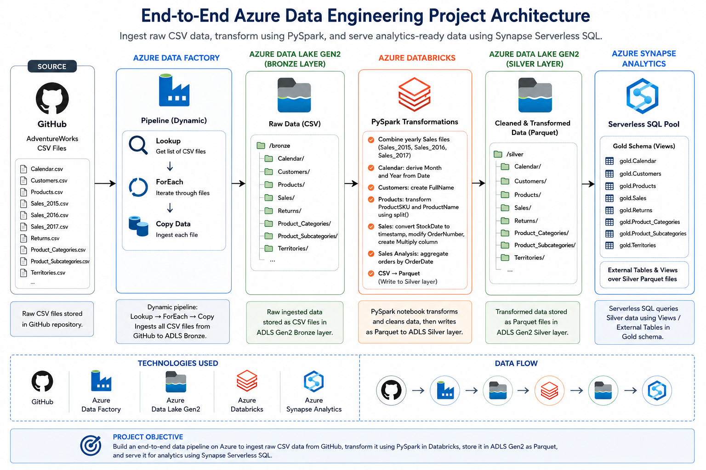
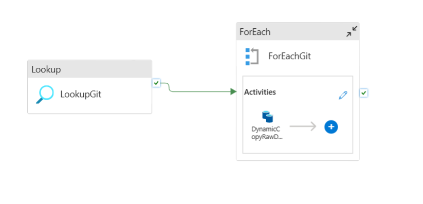
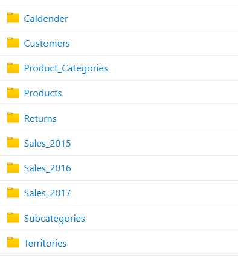
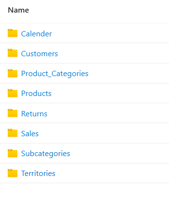
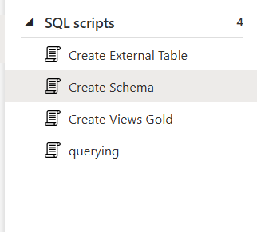

# End-to-End Azure Data Engineering Project

An end-to-end data engineering project built on Microsoft Azure using **Azure Data Factory, Azure Data Lake Storage Gen2, Azure Databricks, PySpark, and Azure Synapse Analytics**.

The project implements a data pipeline that ingests raw AdventureWorks CSV files from GitHub, stores them in a Bronze layer, transforms the data using PySpark, stores the processed data as Parquet in a Silver layer, and makes the data available for querying through Azure Synapse Serverless SQL.

> This is a guided learning project implemented in my own Azure environment to gain hands-on experience with cloud data engineering services and end-to-end pipeline development.

---

## Architecture



### Data Flow

```text
GitHub (CSV)
      ↓
Azure Data Factory
      ↓
ADLS Gen2 - Bronze
      ↓
Azure Databricks / PySpark
      ↓
ADLS Gen2 - Silver (Parquet)
      ↓
Azure Synapse Analytics
      ↓
Gold Schema - Views / External Tables
```

---

## Technologies Used

| Technology | Purpose |
|---|---|
| GitHub | Source storage for the AdventureWorks CSV files |
| Azure Data Factory | Dynamic data ingestion and pipeline orchestration |
| Azure Data Lake Storage Gen2 | Bronze and Silver data storage |
| Azure Databricks | Distributed data processing environment |
| PySpark | Data transformation and processing |
| Apache Parquet | Storage format for transformed Silver data |
| Azure Synapse Analytics | Serverless SQL querying and data serving |
| T-SQL | Views, schemas, external tables, and querying |

---

## Dataset

The project uses the **AdventureWorks** dataset, containing data related to:

- Customers
- Products
- Product categories and subcategories
- Sales from 2015–2017
- Returns
- Territories
- Calendar dates

The dataset was originally sourced from **Kaggle** and is included in the [`data`](data/) directory for this project.

**Dataset source:** [Kaggle – AdventureWorks Dataset](https://www.kaggle.com/datasets/ukveteran/adventure-works/data)
---

## 1. Dynamic Data Ingestion with Azure Data Factory

Azure Data Factory is used to ingest the AdventureWorks CSV files from GitHub into the **Bronze layer** of Azure Data Lake Storage Gen2.

Instead of creating a separate Copy activity for every source file, the pipeline uses a **metadata-driven dynamic ingestion approach**.



The pipeline consists of:

**Lookup → ForEach → Copy Data**

### Lookup

The Lookup activity reads configuration metadata from `Git.json`.

Each configuration entry specifies:

- Source relative URL
- Destination folder
- Destination filename

Example:

```json
{
    "parameterized_Rel_URL": "/Rawan-Arafa-DE/awsProject/refs/heads/main/Data/AdventureWorks_Customers.csv",
    "parameterized_Sink_Folder": "Customers",
    "parameterized_File_Name": "Customers.csv"
}
```

The configuration file is available under [`config/Git.json`](config/Git.json).

### ForEach

The ForEach activity receives the output of the Lookup activity:

```text
@activity('LookupGit').output.value
```

It iterates through each configuration object.

### Dynamic Copy

During each iteration, the Copy activity dynamically retrieves the source path:

```text
@item().parameterized_Rel_URL
```

and dynamically determines the destination:

```text
@item().parameterized_Sink_Folder
@item().parameterized_File_Name
```

This allows multiple datasets to be ingested using a single reusable Copy activity.

---

## 2. Bronze Layer

Raw CSV files ingested by Azure Data Factory are stored in the **Bronze container** in ADLS Gen2.



The Bronze layer preserves the source datasets before transformation.

It includes datasets such as:

```text
bronze/
├── Calendar/
├── Customers/
├── Product_Categories/
├── Products/
├── Returns/
├── Sales_2015/
├── Sales_2016/
├── Sales_2017/
├── Subcategories/
└── Territories/
```

---

## 3. Data Transformation with Azure Databricks

Azure Databricks and **PySpark** are used to read data from the Bronze layer, perform transformations, and write the processed data to the Silver layer.

The complete notebook is available here:

[`notebooks/silver_layer_transformations.ipynb`](notebooks/silver_layer_transformations.ipynb)

Transformations implemented in the notebook include:

- Combining the yearly sales datasets
- Deriving month and year fields from calendar dates
- Creating customer full names
- Transforming product SKU and product name fields
- Converting sales date/time data types
- Applying column-level transformations to sales data
- Performing a basic sales aggregation by order date
- Converting the processed datasets from CSV to Parquet

Credentials used by the original Azure environment are intentionally excluded from the public notebook.

---

## 4. Silver Layer

After processing in Databricks, transformed datasets are written to the **Silver container** in ADLS Gen2 using the Parquet format.



The resulting structure includes:

```text
silver/
├── Calendar/
├── Customers/
├── Product_Categories/
├── Products/
├── Returns/
├── Sales/
├── Subcategories/
└── Territories/
```

The separate yearly Sales datasets from the Bronze layer are processed into a consolidated Sales dataset in Silver.

---

## 5. Azure Synapse Analytics

Azure Synapse Analytics Serverless SQL is used to query the processed Parquet data stored in ADLS Gen2.

The implementation includes:

- Creation of a `gold` schema
- Serverless SQL access to Silver Parquet files
- Views over the processed datasets
- External data sources
- External Parquet file format
- External table creation using CTAS



SQL scripts are available in the [`sql`](sql/) directory:

```text
sql/
├── 01_create_schema.sql
├── 02_create_external_table.sql
└── 03_create_gold_views.sql
```

Managed Identity is used by Synapse when accessing the Azure storage account, avoiding embedded storage credentials in the SQL scripts.

---

## Repository Structure

```text
.
├── architecture/
│   └── azure-data-engineering-architecture.png
│
├── config/
│   └── Git.json
│
├── data/
│   └── AdventureWorks CSV files
│
├── notebooks/
│   └── silver_layer_transformations.ipynb
│
├── screenshots/
│   └── Azure implementation screenshots
│
├── sql/
│   ├── 01_create_schema.sql
│   ├── 02_create_external_table.sql
│   └── 03_create_gold_views.sql
│
└── README.md
```

---

## Key Concepts Practiced

Through this project, I gained hands-on experience with:

- Building an end-to-end cloud data pipeline
- Metadata-driven ingestion using Azure Data Factory
- Parameterizing ADF datasets and activities
- Organizing data using Bronze and Silver layers
- Processing datasets with Spark DataFrames and PySpark
- Reading and writing data between Databricks and ADLS Gen2
- Working with Parquet files
- Querying data lake files using Synapse Serverless SQL
- Creating SQL views and external tables over data lake storage
- Connecting multiple Azure data services into a single workflow

---

## Acknowledgements

This project was built as a hands-on learning project by following **Ansh Lamba's Azure End-to-End Data Engineering tutorial**.

The project was recreated in my own Azure environment to practice the implementation and integration of Azure Data Factory, ADLS Gen2, Azure Databricks, PySpark, and Azure Synapse Analytics.

Tutorial: [Azure End-To-End Project — Ansh Lamba](https://youtu.be/0GTZ-12hYtU)
